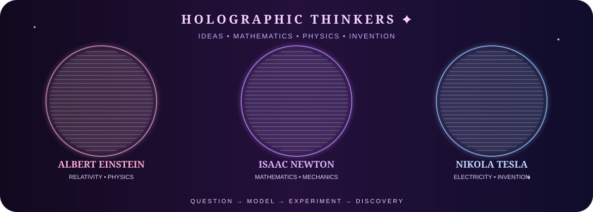

<div align="center">

<!-- 🌸 FUTURE BUILDER HEADER -->


<br>

<div align="right">
  <h1>𝓑</h1>
  <sub>✦ Bredalis' Lab ✦</sub>
</div>

<!-- 🩷 PROFILE IMAGE -->


<br><br>

<a href="https://github.com/li-future-builder">

</a>
<a href="https://www.linkedin.com/in/bredalis-gautreaux/">

</a>
<a href="https://www.youtube.com/@lifuturebuilder">

</a>
<a href="https://www.pinterest.com/lifuturebuilder/">

</a>

</div>

---

<div align="center">

## 🎀 `THE FUTURE BUILDER`

> **Curious mind • big dreams • soft heart**  
> I’m exploring the mathematics, artificial intelligence and physics that shape the technologies of tomorrow.  
> My goal is simple: **learn deeply → experiment → build → discover.** 🧠✨

🌸 AI & Machine Learning &nbsp; • &nbsp; ∞ Mathematics &nbsp; • &nbsp; ⚛️ Quantum Physics &nbsp; • &nbsp; 🪐 STEM

</div>

---

## 🧠 AI LAB

<div align="center">


<br>


</div>

### ✦ Current AI focus

| Area | Exploring |
|---|---|
| 🤖 Artificial Intelligence | Machine learning, model fundamentals & intelligent systems |
| 🧠 Deep Learning | Neural networks and representation learning |
| 💬 NLP | Language, text processing and intelligent interfaces |
| 📊 Data | NumPy, Pandas, data analysis & visualization |
| 🧮 AI Mathematics | Linear algebra, probability, statistics & calculus |

> **I don't want to only use AI. I want to understand the ideas and mathematics that make it possible.** 💗

---

## 🧮 MATHEMATICS × PHYSICS

<div align="center">

```text
        ∞  MATHEMATICS IS THE LANGUAGE  ∞

        e^(iπ) + 1 = 0
        F = ma
        Δx · Δp ≥ ℏ / 2
        A·x = b
        P(A|B) = P(B|A)P(A) / P(B)

        ──────────────── ✦ ────────────────

        algebra • linear algebra • calculus
        probability • statistics • quantum ideas
```

</div>

I’m especially fascinated by the point where **mathematics, computation and physics meet** — from vectors and matrices to probability, information and quantum concepts. 🫧⚛️

---

## 🧪 MY DIGITAL LAB

<div align="center">


</div>

<div align="center">


</div>

---

## 👩🏻‍🔬 HOLOGRAPHIC THINKERS

<div align="center">




</div>

---

## 🐈‍⬛ DIGITAL COMPANION

<div align="center">


### `01001000 01101001 ✨`

<sub>Even future laboratories need a tiny cat supervisor.</sub> 🎀🐾

</div>

---

<div align="center">

## 🌐 FIND ME IN THE DIGITAL UNIVERSE

<a href="https://www.youtube.com/@lifuturebuilder">YouTube</a>
&nbsp; ✦ &nbsp;
<a href="https://www.linkedin.com/in/bredalis-gautreaux/">LinkedIn</a>
&nbsp; ✦ &nbsp;
<a href="https://www.pinterest.com/lifuturebuilder/">Pinterest</a>
&nbsp; ✦ &nbsp;
<a href="https://github.com/li-future-builder">GitHub</a>

<br><br>


<br><br>

### 🎀 `what if…?` 🫧


</div>
